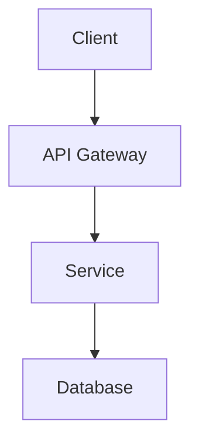

## Architecture Improvement

### Architecture Area

<!-- Check all that apply -->

- [ ] System Design
- [ ] API Design
- [ ] Database Architecture
- [ ] Frontend Architecture
- [ ] Backend Architecture
- [ ] Microservices/Modularity
- [ ] Security Architecture
- [ ] Scalability Design
- [ ] Design Patterns
- [ ] Other (please specify)

### Current Architecture

<!-- Describe the current architectural approach or limitation -->

### Proposed Architecture

<!-- Describe your proposed architectural improvement -->

### Architecture Diagram

<!-- Provide or link to architecture diagrams (Mermaid, PlantUML, or images) -->

### Design Rationale

**Why This Change:**

<!-- Explain the reasoning behind this architectural decision -->

**Benefits:**

-
-
-

**Trade-offs:**

<!-- What are the compromises or costs of this approach? -->

-
-
-

### Affected Components

<!-- Which parts of the system will be impacted? -->

**System Layers:**

- [ ] Presentation Layer (Frontend)
- [ ] API Layer
- [ ] Business Logic Layer
- [ ] Data Access Layer
- [ ] Infrastructure Layer
- [ ] Other:

**Specific Components:**

<!-- List affected modules, services, or packages -->

-
-
-

### Technical Approach

**Design Patterns:**

<!-- Check all that apply -->

- [ ] MVC/MVVM
- [ ] Repository Pattern
- [ ] Factory Pattern
- [ ] Observer Pattern
- [ ] Dependency Injection
- [ ] CQRS
- [ ] Event Sourcing
- [ ] Other:

**Architecture Principles:**

<!-- Check principles this change follows -->

- [ ] SOLID Principles
- [ ] DRY (Don't Repeat Yourself)
- [ ] KISS (Keep It Simple, Stupid)
- [ ] Separation of Concerns
- [ ] Single Responsibility
- [ ] Open/Closed Principle
- [ ] Dependency Inversion
- [ ] Other:

### Implementation Plan

**Phase 1 - Planning:**

1.
2.
3.

**Phase 2 - Implementation:**

1.
2.
3.

**Phase 3 - Migration:**

<!-- If migrating from existing architecture -->

1.
2.
3.

### Impact Analysis

**Breaking Changes:**

- [ ] Yes - requires migration
- [ ] No - backward compatible

**Performance Impact:**

- [ ] Positive (improves performance)
- [ ] Neutral (no significant change)
- [ ] Negative (requires optimization)

**Code Complexity:**

- [ ] Reduces complexity
- [ ] Neutral
- [ ] Increases complexity (but justified)

### Scalability Considerations

<!-- How does this architecture scale? -->

**Scalability:**

- [ ] Horizontal scaling supported
- [ ] Vertical scaling supported
- [ ] Auto-scaling ready
- [ ] N/A

**Load Handling:**

<!-- Expected load capacity and bottlenecks -->

### Security Considerations

<!-- What security implications does this architecture have? -->

**Security Measures:**

- [ ] Authentication strategy defined
- [ ] Authorization model clear
- [ ] Data encryption addressed
- [ ] Input validation enforced
- [ ] Rate limiting considered
- [ ] Other:

### Testing Strategy

<!-- How will this architecture be validated? -->

**Testing Levels:**

- [ ] Unit tests for components
- [ ] Integration tests for layers
- [ ] End-to-end tests
- [ ] Load testing
- [ ] Security testing
- [ ] Other:

### Documentation Requirements

<!-- What documentation needs to be created or updated? -->

- [ ] Architecture Decision Record (ADR)
- [ ] System architecture diagram
- [ ] Sequence diagrams
- [ ] API documentation
- [ ] Developer guides
- [ ] Other:

### Migration Path

<!-- If changing existing architecture, how will migration work? -->

**Migration Strategy:**

- [ ] Big Bang (all at once)
- [ ] Phased/Incremental
- [ ] Parallel Run (gradual transition)
- [ ] N/A (new feature)

**Rollback Plan:**

### Alternative Approaches Considered

<!-- What other solutions were evaluated? -->

1. **Alternative 1:**
   - Description:
   - Why rejected:

2. **Alternative 2:**
   - Description:
   - Why rejected:

### References & Resources

<!-- Link to relevant articles, RFCs, or documentation -->

-
-
-

### Additional Context

<!-- Add any other relevant information, mockups, or examples -->

### Estimated Effort

<!-- Select one -->

- [ ] Small (< 4 hours)
- [ ] Medium (1-3 days)
- [ ] Large (1-2 weeks)
- [ ] Extra Large (> 2 weeks)

---

**Complexity:** low | medium | high
**Priority:** high | medium | low
**Requires RFC:** yes | no
